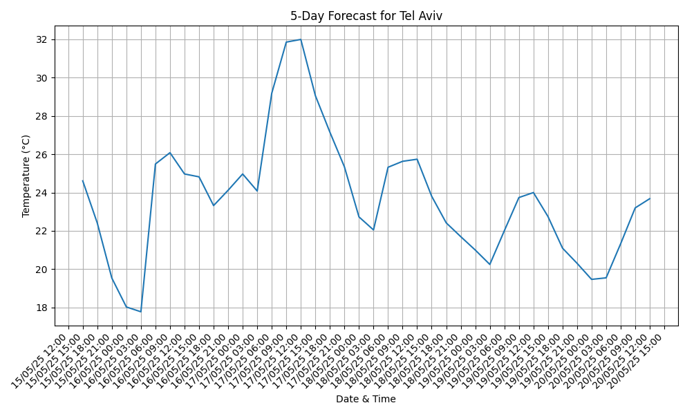

# 🌦️ Weather Data Pipeline with Visualization & Notifications

This Python project fetches real-time and forecasted weather data from the OpenWeatherMap API, visualizes it using plots, and sends automated email alerts for important weather conditions.

It's designed with modular architecture, secure configuration handling, caching optimization, and practical automation — showcasing a well-rounded set of backend and scripting skills.

---

## 🧠 What You’ll Learn From This Project

- 🔌 How to interact with a **real-world REST API**
- 🧱 How to design a **modular Python application**
- 🔐 How to manage **secure credentials** with `.env` files
- 📬 How to send **automated email notifications**
- 📊 How to plot **forecast data with `matplotlib`**
- ⚡ How to implement **local caching** to reduce redundant API requests

---

## 📁 Project Structure

```
weather_project/
├── main.py                 # User entry point – CLI interface
├── config.py               # Loads secure API & email config from environment
├── weather_data.py         # Handles weather API calls and caching
├── visualization.py        # Generates time-series weather plots
├── email_notifications.py  # Sends email alerts with SMTP
├── API.env                 # Stores your API/email credentials (not committed)
├── .gitignore              # Protects secrets and cache from being pushed
└── README.md               # This documentation
```

---

## 🔧 Setup Instructions

### 1. Clone the Repository

```bash
git clone https://github.com/Asaf-Alber/Weather_API.git
cd Weather_API
```

### 2. Create and Activate a Virtual Environment (optional)

```bash
python -m venv venv
source venv/bin/activate   # or venv\Scripts\activate on Windows
```

### 3. Install Dependencies

```bash
pip install requests matplotlib python-dotenv
```

### 4. Add Your API Key and Email Credentials

Create a file named `.env` or `API.env` and add:

```ini
OPENWEATHER_API_KEY=your_openweather_key
EMAIL_USER=your_email@gmail.com
EMAIL_PASSWORD=your_app_password
```

> 💡 Use an app-specific password for Gmail if 2FA is enabled.

---

## ▶️ Running the Program

```bash
python main.py
```

- You’ll be prompted for a city name and language.
- The program will fetch the current weather and 5-day forecast.
- A plot will be displayed.
- You’ll receive an email summary (to the sender’s address).

---

## 📈 Example Output


```
Enter city name (default: 'London'): Tel Aviv
Enter preferred language (leave blank for 'en'): en
Using cached data for Tel Aviv
Weather for Tel Aviv:
Temperature: 24.54°C
Humidity: 58%
Weather: Clear sky
```

### 📊 Plot Example




---

## ⚙️ Technical Highlights

| Area               | What You Demonstrated                                 |
|--------------------|--------------------------------------------------------|
| 🌐 API Integration | Calling REST API with `requests` and parameters       |
| 🧱 Software Design | Clean, modular Python structure                        |
| 🔐 Security        | Environment-based config with `dotenv`                |
| 📊 Visualization   | Time-series plotting with `matplotlib`                |
| 📬 Automation      | Sending email with SMTP + exception handling          |
| ⚡ Optimization     | Smart caching using file system + timestamp check     |

---

## 📌 Features Recap

- ✅ Current weather data for any city
- ✅ 5-day forecast with time-series chart
- ✅ Email summary via SMTP
- ✅ Caching to reduce API requests
- ✅ CLI input for city and language
- ✅ Modular and maintainable Python code

---

## 🧩 Possible Future Enhancements

- Add threshold-based alerting (e.g., warn if >35°C or storm incoming)
- Support batch weather checking for multiple cities
- Export forecast to CSV/JSON
- Turn this into a web app using Flask or FastAPI
- Add unit tests and CI workflow

---

## 🙋‍♂️ About the Author

**Asaf Alber**  
📍 Electrical & Software Engineering Student  
🔗 [GitHub: @Asaf-Alber](https://github.com/Asaf-Alber)

> This project is part of my exploration into combining hardware-aware thinking with clean backend automation.

---

## 📄 License

This project is open source under the [MIT License](https://opensource.org/licenses/MIT).
